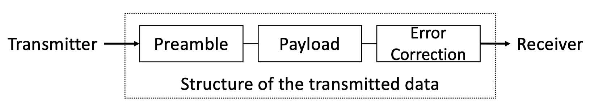

# Covert Channels

## I. Covert Channels

### 1. Definition

- **Communication Paths** that were **neither designed nor intended** to **transfer information** between **system processes**

### 2. Examples

- **Storage-based** Covert Channel: high process encodes classified info. to **file metadata**
- **Timing-based** Covert Channel: high process encodes classified info. to **CPU loads**

### 3. Side Channels vs Covert Channels

#### 3.1. Side Channels

- **Un**intentional Leakage
- Electromagnetic Emanation/Power Consumption correlates with a computation

#### 3.2. Covert Channels

- **In**tentional Leakage
- Covert Channels can **encode and embed** data into **Side Channels Emanation**
- **Binary payload** will be **encoded** into **distinct computation** to generate **distinct** EE/PC

### 4. Generic Attack Scenario

#### 4.1. Transmitter

- **Isolated** from Receiver - **high level** security
- **Contain** sensitive Data to be **extracted**
- **Infected** by attacker's code
- Attacker's code can **encode** data and **transmit** via Covert Channel

#### 4.2. Receiver

- **Isolated** from Transmitter - **low level** security
- **Controlled** by attacker's code
- **Monitor** Covert Channel to **capture** Signal's **Preamble**
- **Decode** Payload

## II. Types of Covert Channels

### 1. Physical / Out-of-Band

- Use a **shared physical medium**
- **Example**:
  - **Acoustic**: Ultrasonic Wave $\rightarrow$ Microphone
  - **Radio & Electromagnetic**: Emanation from Electronic components $\rightarrow$ EM Antena
  - **Optical**: LED $\rightarrow$ Camera

### 2. Software / Micro-architectural

- Use a **shared system resources**
- **Example:**
  - **Exploit** **differences** between **access** to **cached** and **non-cached** memory
  - **Speculative** execution attack

### 3. Network

- Use **traditional network** as a **shared medium**
- **Example:**
  - **Modify** custom TCP/IP headers, fields, timestamps
  - Modify **Package transmission rate**

## III. Properties of Covert Channels

### 1. Signal-to-Noise Ratio

- **Transmission** can be **affected** by **internal/external noise**
- **Error-correcting code** can correct transmission error
- $SNR = 10*log (\frac{P_{signal}}{P_{noise}}) dB$

### 2. Modulation Scheme

- **Define** how **binary payload** is **modulated** into the **channel’s signal**
- Example: **Amplitude**-Shift Keying, **Frequency**-Shift Keying

### 3. Capacity

- **Depend** on the **channel characteristics** and **modulation scheme**
- $Capacity = Bandwidth * log_2(1 + SNR)$

### 4. Covertness

- **Imperceptible** to **humans present** in the **environment**
- **Covert** to **adversary aware** of the **channel and modulation**

## IV. Applications of Covert Channels

### 1. Data Exfiltration

- **Extract sensitive data** from **an isolated machine** **without** use of **traditional communication channel**

### 2. Inter-process Covert Channels

- **Communication** between **two processes on same machine**, logically **isolated** by the **OS**

### 3. Cross-device Tracking

- User’s device **receive covert signals** from **another device**, they might be **located near each other** and likely **belong to the same user**

### 4. Location Tracking

- Use **Ultrasonic Covert Channels** to establish **Location Tracking**

### 5. Web Tracking

- Use covert channel to **transmit web session ID** from **isolated web page** to **another** webpage

## V. Countermeasures

### 1. Disadvantages

- Any **shared system resources** can be used to establish Covert Channels
- Any **Side Channel Leakage** can be used to establish Covert Channels

### 2. Methods

- **Control Access** to **Shared System Resources**
- **Detect** Covert **Transmission**
  - Detect **abnormal behavior**
  - **Monitor** Side Channel **Leakage**
- **Limit** **Capacity** of Covert Channel
  - Introduce **noise** and **timing**
  - Limit **bandwidth**

## VI. Sensor-based Covert Channels

- **Smartphones** have many **sensors**
- Those **sensors** are sensitive to **noise**
- Those **reaction** can be used to established Covert Channels

### 1. Gyroscopes-based Covert Channels

- **Transmitter**: speaker-equipped device
  - **Embed payload** into **ultrasonic sounds** at **resonance** frequency
  - **Play** the **acoustic signal**

- **Receiver**: malicious app on user’s smartphone
  - **Record** gyroscope samples
  - **Capture** the signal by analyzing **sensor disturbance**
  - Decode payload
- **Countermeasure**:
  - **Restrict** the **freq. of speaker** to the **freq. band**, can hear by human (20-20k KHz)
  - Smartphone gyroscopes have resonance frequency > 20 KHz
  - Thus prevent an attack

### 2. Magnetometers-based Covert Channels

- **Transmitter**: malicious app / webpage on a laptop or a smartphone
  - **Embeds payload** into distinct **CPU activity patterns**

- **Receiver**: malicious app on user’s smartphone
  - **Record** magnetometer samples
  - **Capture** the signal by analyzing **sensor disturbance**
  - Decode payload
- **Countermeasure**:
  - **Restrict** access to magnetometers and magnetic sensors data

